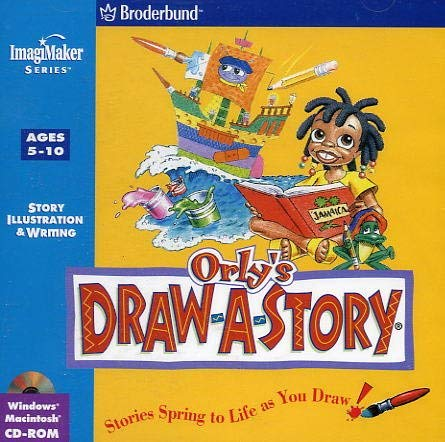

# Orly's Draw-A-Story (2026 Windows patches)

## What's this?

_Orly's Draw-A-Story_ is a really lovely interactive title for kids released 
in 1996 by Broderbund, and developed by _Toejam And Earl Studios_.  It is
an interactive colouring book, narrated by a Jamaican girl called Orly and
her frog friend Lancelot.  My wife studied a bunch of kids CD-ROM games years 
ago and Orly was our favourite.

Orly was developed for Windows 95 and Windows 3.1, and has not worked on 
modern Windows for years.

This project injects new code into the game to make it work again, so it
behaves properly alongside other Windows apps.

Orly runs on the Mohawk engine, which was used for smash hits Myst and Riven 
in the 1990s. The [ScummVM project](https://scummvm.org/) supports some
Mohawk titles, but not Orly.  So it needed some targeted patches to bring
it back to life.

## What does the patch do?

There were several bugs that stop the game from running completely, so those
are fixed (see below for gory details). There are some other changes from
how the game used to run:

* The game now starts in a resizable window, without changing your desktop
  resolution.
* (though it will always go to full screen on the Steam Deck)
* You can press Alt-Enter to go in and out of full-screen mode.
* You can press F1-F4 to switch between different smoothing filters, depending
  on how you like to see the original artwork on your gigantic screen.
* The game saves its pictures to your user directory, not its installation 
  directory (i.e. `AppData\Roaming\Orly's Draw-A-Story`).
* There is a new installer that bundles the patch with the original game.

Finally if the game crashes, it should put a useful crash dump into the user
directory, which I can use to pin down the problem.

## How to patch the game

Orly's Draw-A-Story was originally published by Broderbund, but the IP has
been purchased several times over, I think it may be Ubisoft?  But this
patch does not conntain any original files from the game.  You need to combine 
it with the CD image.

I've tried to write these instructions for non-developers to follow.
They should take about 15 minutes.

If you've already got dev tools on your computer, you might want to read
the scripts before running them.

Download two things:
* The [CD image from archive.org](https://archive.org/details/orly1996)
* The patch source code:
  * Developers: `git clone https://github.com/matthewbloch/orlys-draw-a-story-fixes.git`
  * Everyone else: (Download link)[https://github.com/matthewbloch/orlys-draw-a-story-fixes/archive/refs/heads/main.zip]

If you're not a developer who uses PowerShell regularly, you'll need to:
* Open Windows Settings and enable "Enable local Powershell scripts to run
  without being signed".
* Open Windows Settings, navigate to _Virus And Threat Protection_, scroll down to _Virus And Threat Protection Settings_, and _Manage Settings_. Then go to _Add Or Remove Exclusions_ and select the `orlys-draw-a-story-fixes` folder.

Then:
* Open Powershell in a terminal and navigate to the source directory e.g. `cd $ENV:HOMEDIR\Downloads\orlys-draw-a-story-fixes`
* Run `.\Build.ps1` and wait for the build tools to download and install 
  themselves.  You will need to accept some UAC prompts.
* Run `.\Repack.ps1 -ISO Orly.ISO` to extract the files from the original
  CD-ROM and build a new installer, combined with the path (Orly.ISO should be the pathname of your original CD-ROM image).
* After a minute or so, you can find the new installer inside the `tmp` folder, and
  run it to install the game.

## Settings (orlyfix.ini)

Three is a settings file which is consulted for startup options, but you 
probably don't need to touch it.

| Key | Values |
|---|---|
| Fullscreen | starting mode: 0 = window (default), 1 = borderless full screen |
| WindowScale | starting window size as a multiple of 640x480 (default 2) |
| Filter | 0 sharp pixels, 1 bilinear, 2 bicubic (default), 3 sharp bilinear - GPU, GDI fallback |
| VSync | 1 = in step with the monitor refresh (default) |

Changes to Filter are saved back to the file, anything else you'll need
to edit in Notepad.

## How it works (gory details)

We build a .dll that patches various game functions, and copy it into the game
folder alongside the original `ORLY32.EXE`.

The original game is hardwired to load a file called `winspool.dll` for its 
printing functions, but that name has long been renamed in Windows.  So we 
borrow the name so Windows will calls our code before its own.

## Bug fixes

* **CPU** is pinned to 1 core, as multi-core CPUs (which didn't exist at the time)
  trigger bugs in the engine.
* **Main loop** now sleeps between frames, rather than pegging the CPU in a busy 
  loop.
* **Sound task stack** (8 KB) overflowed in Windows' modern audio stack, 
  killing the process: tasks get 60 KB.
* **Disc free-space check** was broken, now effectively disabled.
* **Palette / system colours**: the game no longer changes other programs' 
  colours or broadcasts to every window.
* We emulate the **256-colour screen behaviour** - all the drawing functions
  are hooked, emulated as per 1997 GDI assumptions, and then blitted by
  a separate display layer.
* The **Display** is now a resizeable window that displays the canvas through
  a configurable OpenGL filter.
* **Media keys** are not passed through to the game, so you don't accidentally
  skip animations when you're just changing your system volume.
* **Printer initialisation** is fixed so that the game will run under
  WINE, Crossover, Proton (Steam Deck).
* Fix a **race condition** which crashes when loading a new drawing, probably
  because 1997 storage devices were slow enough to never trigger it.

## Credits

This patch is distributed under the CC0 license, effectively public domain.

The installer and other scripting was written and tested by me, Matthew Bloch
<matthew@bloch.tv>.

The extractor for InstallShield files is 
[idecomp](https://github.com/lephilousophe/idecomp) and is included unmodified.

While I have written plenty of blitting and emulation code in the past, the
project was made possible by LLM-accelerated disassembly and crash dump 
analysis.

The code is all LLM output, and is likely based on this prior art:

* [dxwnd](https://dxwnd.org/)
* [DDrawCompat](https://github.com/narzoul/DDrawCompat)
* [Sharp-Bilinear-Shaders](https://github.com/rsn8887/Sharp-Bilinear-Shaders)
* [Ultimate ASI Loader](https://github.com/ThirteenAG/Ultimate-ASI-Loader)

Therefore I do not claim any rights to the code under the `src/` directory.

Credit would be nice if you take this patch forward, but it's not essential.

The original game was written by Greg Johnson, Mark Voorsanger and team. 
Full credits at 
[MobyGames](https://www.mobygames.com/game/140066/orlys-draw-a-story/), 
and in the game itself.

## Bugs (Ribbit, mon)

A couple of quality issues I've seen:

* when cutting between frames with different colour palettes, there is sometimes
  a 1-frame flash of the the old frame with a new palette.
* I've heard an occasional crackle on steam Deck, but I'm not sure if this isn't
  in the source.

I would like it to feel better on the Steam Deck, but it's playable
once you've jumped through the hoop of installing it in Desktop mode.

Anything else, email me! matthew@bloch.tv
